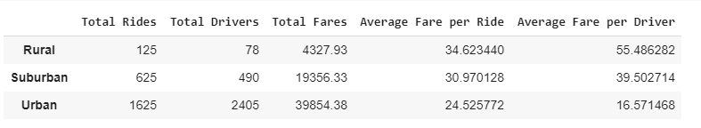

# PyBer Analysis

## Overview of the analysis:

The purpose of this project is :
* To create a summary DataFrame of the ride-sharing data by city type.
* To create a multiple-line graph that shows the total weekly fares for each city type.
* To summarize how the data differs by city type.

## Results:

The summary of the total rides, total driver count, total fare, average fare per ride and average fare by driver by city type can be found in the figure below.

### 1. Total rides per city type :

Total rides by city type can be found 

### 2. Total drivers per city type :

### 3. Total fares for each city type : 

### 4. Average fare per ride by city type :

### 5. Average fare per driver by city type : 

### 6. Total fare amount for each date and time :

## Summary:
