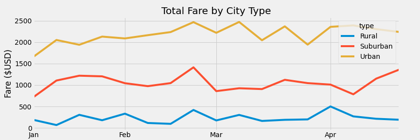

# PyBer Analysis

## Overview of the analysis:

The purpose of this project is :
* To create a summary DataFrame of the ride-sharing data by city type.
* To create a multiple-line graph that shows the total weekly fares for each city type.
* To summarize how the data differs by city type.

## Results:

The summary of the total rides, total driver count, total fare, average fare per ride and average fare by driver by city type can be found in the DataFrame below.

### 1. Total rides per city type :

- The total rides in urban city type is **1,625** having a percentage of *68.4%* of the total rides.
- The total rides in suburban city type is **625** having a percentage of *26.3%* of the total rides.
- The total rides in rural city type is **125** having a percentage of *5.3%* of the total rides.

The total rides in the urban city type is much higher than in suburban and rural city types.

### 2. Total drivers per city type :

- The total driver count in urban city type is **2,405** having a percentage of *86.7%* of the total driver count.
- The total driver count in suburban city type is **490** having a percentage of *12.5%* of the total driver count.
- The total driver count in rural city type is **78** having a percentage of *0.8%* of the total driver count.

The total drivers in rural city type are much lower than in urban and suburban city types.

### 3. Total fares for each city type : 

- The total fares in urban city type is **$39,854.38** having a percentage of *66.7%* of the total fares.
- The total fares in suburban city type is **$19,356.33** having a percentage of *30.5%* of the total fares.
- The total fares in rural city type is **$4,327.93** having a percentage of *6.8%* of the total fares.

The total fares in urban city types is much higher than suburban and rural city types.

### 4. Average fare per ride by city type :

- The average fare per ride in urban city type is **$24.53**.
- The average fare per ride in suburban city type is **$30.97**.
- The average fare per ride in rural city type is **$34.62**.

Box-and-Whisker plot of the average fare per ride by city type:

The average fare per ride in urban is lower than in suburban and rural city types.

### 5. Average fare per driver by city type : 

- The average fare per driver in urban city type is **$16.57**.
- The average fare per driver in suburban city type is **$39.50**.
- The average fare per driver in rural city type is **$55.49**.

The average fare per driver in rural is higher than in urban and suburban city types.

### 6. Total weekly fare amount for city type:

The total weekly fare amount for each date per city type can be found in the multiple line graph. The total fare amount for urban city type is much higher than that of suburban and rural city types.

## Summary:

